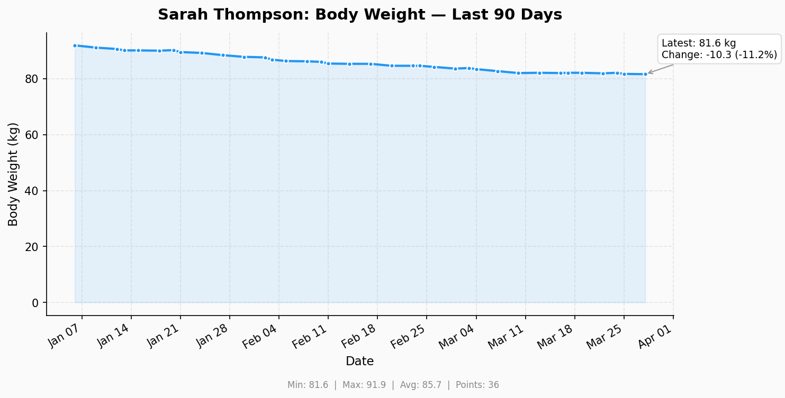
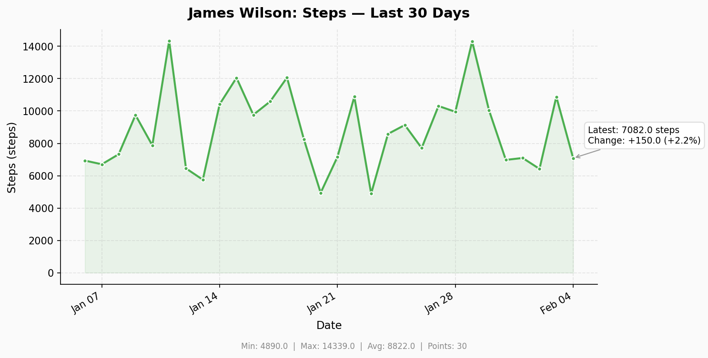
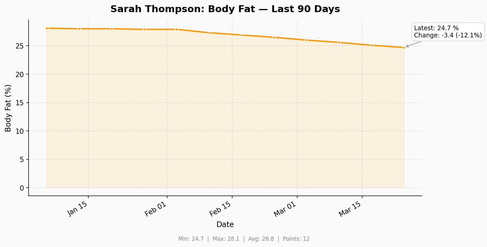
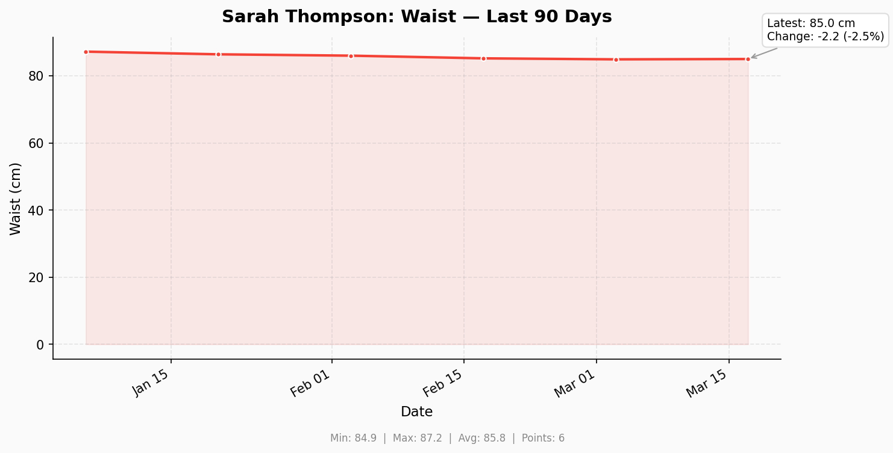

# Kahunas Python Client

Python client library, CLI, and MCP server for the [Kahunas](https://kahunas.io) fitness coaching platform.

## Features

- **Python Client** — Async HTTP client (`httpx`) with Pydantic v2 models, automatic token refresh, retry logic, and connection resilience
- **MCP Server** — [Model Context Protocol](https://modelcontextprotocol.io/) server with **75 tools**, compact JSON payloads, and support for **stdio**, **HTTP/SSE**, and **streamable-http** transports (session-isolated via `contextvars`)
- **CLI** — Command-line interface with rich terminal output for managing clients, workouts, exercises, and exports
- **Charts** — Generate PNG progress charts (body weight, body fat, steps, measurements) using `matplotlib`
- **Calendar Sync** — Sync Kahunas appointments with Google Calendar or Apple Calendar (iCal), with preview/add/remove/sync/trust modes for LLM-driven orchestration
- **Check-in History** — Tabular check-in summaries with body measurements, lifestyle ratings, and trend analysis
- **Local Metrics Store** — SQLite-backed timeseries database for offline chart generation and metric queries
- **WhatsApp Integration** — Send messages and attachments to clients via WhatsApp Business Cloud API with automatic phone number normalisation (UK +44 default)
- **Data Export** — Export all client data (profiles, check-ins, progress photos, workouts, habits, chat history) to Excel files and PDF reports
- **PDF Export** — Generate professionally formatted PDFs for workout programs, check-in summaries, and workout plans using `fpdf2`
- **Anomaly Detection** — Detect significant changes in weight, body measurements, lifestyle ratings, and sleep/step minimums with configurable thresholds
- **Check-in Reminders** — Find overdue clients and send personalised reminders via Kahunas chat and/or WhatsApp
- **Phone Alignment** — Compare and fix phone numbers between Kahunas client data and WhatsApp E.164 format
- **Messaging Persona** — Configurable persona template for client communications (default: London-based PT, 15 years experience, British English) — see [`persona.example.txt`](persona.example.txt)
- **Incremental Data Sync** — Mirror all Kahunas data to a local SQLite database with delta-only synchronisation. Syncs clients, check-ins (with photos), progress metrics, habits, chat messages, workout programs, and exercises. Includes media download tracking for photos and attachments
- **Docker & Cloud** — Production-ready Dockerfile for Azure Container Instances, AWS Lambda (container), and Kubernetes
- **Configurable Units** — Weight (kg/lbs), height (cm/inches), glucose, food, and water units matching the Kahunas coach configuration page
- **Auto Re-authentication** — Tokens are automatically refreshed when they expire

## Requirements

- Python 3.12+
- A Kahunas coaching account (email & password or auth token)

## Installation

```bash
pip install kahunas-client
```

Or install from source:

```bash
git clone https://github.com/api-py/kahunas-python-client.git
cd kahunas-python-client
pip install -e ".[dev]"
```

## Configuration

The client supports multiple ways to provide credentials, in order of priority:

### 1. Environment Variables

```bash
export KAHUNAS_EMAIL="you@example.com"
export KAHUNAS_PASSWORD="your-password"

# Optional: WhatsApp Business API
export WHATSAPP_TOKEN="your-meta-cloud-api-token"
export WHATSAPP_PHONE_NUMBER_ID="your-whatsapp-phone-number-id"
export WHATSAPP_DEFAULT_COUNTRY_CODE="44"  # UK default

# Optional: Calendar Sync
export KAHUNAS_CALENDAR_PREFIX="Workout"       # Event title prefix
export KAHUNAS_DEFAULT_GYM="PureGym London"    # Default location
export KAHUNAS_GYM_LIST="PureGym,The Gym,Home" # Available gyms
export KAHUNAS_CALENDAR_DEFAULT_DURATION="60"  # Minutes

# Optional: Measurement Units (match Kahunas coach/configuration)
export KAHUNAS_WEIGHT_UNIT="kg"       # kg or lbs
export KAHUNAS_HEIGHT_UNIT="cm"       # cm or inches
export KAHUNAS_GLUCOSE_UNIT="mmol_l"  # mmol_l or mg_dl
export KAHUNAS_FOOD_UNIT="grams"      # grams, ounces, qty, cups, oz, ml, tsp
export KAHUNAS_WATER_UNIT="ml"        # ml, l, or oz

# Optional: Timezone
export KAHUNAS_TIMEZONE="Europe/London"  # IANA timezone

# Optional: Check-in Reminders
export KAHUNAS_CHECKIN_REMINDER_DAYS="7"  # Days before overdue

# Optional: Anomaly Detection Thresholds
export KAHUNAS_ANOMALY_WEIGHT_PCT="20.0"     # Weight % change threshold
export KAHUNAS_ANOMALY_BODY_PCT="15.0"       # Body measurement % threshold
export KAHUNAS_ANOMALY_LIFESTYLE_ABS="3.0"   # Lifestyle rating abs threshold
export KAHUNAS_ANOMALY_WINDOW_DAYS="7"       # Lookback window in days
export KAHUNAS_ANOMALY_SLEEP_MINIMUM="7.0"   # Min sleep score to flag
export KAHUNAS_ANOMALY_STEP_MINIMUM="5000"   # Min daily steps to flag

# Optional: Messaging Persona
export KAHUNAS_PERSONA_TEMPLATE=""            # Inline persona template
export KAHUNAS_PERSONA_TEMPLATE_PATH=""       # Path to template file
export KAHUNAS_PERSONA_WEIGHT_DEVIATION_PCT="20.0"  # Weight deviation %
export KAHUNAS_PERSONA_SLEEP_MINIMUM="7.0"          # Sleep threshold
export KAHUNAS_PERSONA_STEP_MINIMUM="5000"          # Step threshold

# Optional: Incremental Data Sync
export KAHUNAS_SYNC_DB="~/.kahunas/sync.db"  # SQLite database path
```

### 2. `.env` File

```env
KAHUNAS_EMAIL=you@example.com
KAHUNAS_PASSWORD=your-password
WHATSAPP_TOKEN=your-meta-cloud-api-token
WHATSAPP_PHONE_NUMBER_ID=your-whatsapp-phone-number-id
KAHUNAS_WEIGHT_UNIT=lbs
KAHUNAS_HEIGHT_UNIT=inches
KAHUNAS_TIMEZONE=America/New_York
```

### 3. YAML Config File

A full example config for UK-based coaches is provided at [`config.example.yaml`](config.example.yaml).
Copy and customise it:

```bash
cp config.example.yaml config.yaml
# Edit config.yaml with your credentials and preferences
```

Point to it via env var:

```bash
export KAHUNAS_CONFIG_FILE=config.yaml
```

### 4. CLI Flags

```bash
kahunas --email you@example.com --password your-password workouts list
```

### 5. Direct Token (Advanced)

If you already have an auth token, skip the login flow entirely:

```bash
export KAHUNAS_AUTH_TOKEN="your-744-character-token"
```

## Using as a Python Library

```python
import asyncio
from kahunas_client import KahunasClient, KahunasConfig

async def main():
    config = KahunasConfig(email="you@example.com", password="your-password")

    async with KahunasClient(config) as client:
        # List workout programs
        programs = await client.list_workout_programs()
        for p in programs.workout_plan:
            print(f"{p.title} — {p.days} days")

        # Search exercises
        exercises = await client.search_exercises("squat")
        for ex in exercises:
            print(f"{ex.exercise_name} ({ex.exercise_type})")

asyncio.run(main())
```

### Generating Progress Charts

```python
from kahunas_client.charts import generate_chart

# Data points from the Kahunas API (or manual entry)
data = [
    {"date": "2024-01-01", "value": 85.0},
    {"date": "2024-02-01", "value": 83.5},
    {"date": "2024-03-01", "value": 82.0},
]

# Generate a PNG chart
png_bytes = generate_chart(
    data_points=data,
    metric="weight",          # weight, bodyfat, steps, chest, waist, etc.
    time_range="quarter",     # week, month, quarter, year, all
    client_name="John Doe",
    output_path="/tmp/weight_chart.png",
)
```

### WhatsApp Business API

```python
from kahunas_client.whatsapp import WhatsAppClient, WhatsAppConfig, normalise_phone

# Normalise phone numbers (resilient to format variations)
normalise_phone("07700 900 123")     # -> "447700900123"
normalise_phone("+44 7700 900123")   # -> "447700900123"
normalise_phone("0044 7700 900123")  # -> "447700900123"

# Send messages
config = WhatsAppConfig(
    access_token="your-meta-token",
    phone_number_id="your-phone-number-id",
)
async with WhatsAppClient(config) as wa:
    await wa.send_text("447700900123", "Hi! Your check-in looks great.")
    await wa.send_image("447700900123", "https://example.com/chart.png", "Weight progress")
    await wa.send_document("447700900123", "https://example.com/report.xlsx", "report.xlsx")
```

## Using the CLI

```bash
# List workout programs
kahunas workouts list

# Show a specific workout program
kahunas workouts show <uuid>

# List exercises
kahunas exercises list

# Search exercises
kahunas exercises search "bench press"

# List clients
kahunas clients list

# Export client data to Excel
kahunas export client <client-uuid> --output ./exports
kahunas export all-clients --output ./exports
kahunas export exercises --output ./exports
kahunas export workouts --output ./exports

# Raw API call
kahunas api v1/workoutprogram

# Start the MCP server (stdio, default)
kahunas serve

# Start in HTTP mode (for remote hosting)
kahunas serve --transport http --port 8000
```

## Using as an MCP Server

The Kahunas MCP server exposes all API endpoints as tools that AI assistants can call. It supports **stdio** (default), **HTTP/SSE**, and **streamable-http** transports. HTTP sessions are fully isolated via `contextvars` — each connection gets its own `KahunasClient`, `ExportManager`, and `MetricsStore`.

### With Claude Desktop (stdio)

Add to your Claude Desktop config (`~/Library/Application Support/Claude/claude_desktop_config.json`):

```json
{
  "mcpServers": {
    "kahunas": {
      "command": "kahunas-mcp",
      "env": {
        "KAHUNAS_EMAIL": "you@example.com",
        "KAHUNAS_PASSWORD": "your-password",
        "WHATSAPP_TOKEN": "your-meta-token",
        "WHATSAPP_PHONE_NUMBER_ID": "your-phone-id",
        "KAHUNAS_WEIGHT_UNIT": "lbs",
        "KAHUNAS_HEIGHT_UNIT": "inches"
      }
    }
  }
}
```

### With Claude Code (stdio)

Add to your project's `.claude/mcp.json`:

```json
{
  "mcpServers": {
    "kahunas": {
      "command": "kahunas-mcp",
      "env": {
        "KAHUNAS_EMAIL": "you@example.com",
        "KAHUNAS_PASSWORD": "your-password"
      }
    }
  }
}
```

### HTTP/SSE Transport (Remote Hosting)

Run the MCP server over HTTP for remote access from any MCP client:

```bash
# CLI
kahunas serve --transport http --host 0.0.0.0 --port 8000

# Or via module
python -m kahunas_client.mcp http

# Or via environment variables
KAHUNAS_MCP_TRANSPORT=http KAHUNAS_MCP_PORT=8000 kahunas-mcp
```

Connect from an MCP client using the SSE/HTTP endpoint:

```json
{
  "mcpServers": {
    "kahunas": {
      "url": "http://your-server:8000/sse"
    }
  }
}
```

### Available MCP Tools

Once connected, the AI assistant has access to **75 tools** (sorted alphabetically):

| Tool | Description |
|------|-------------|
| `api_request` | Make a raw authenticated API request |
| `appointment_overview` | Get a comprehensive overview of appointments across time windows (upcoming + historical counts) |
| `assign_workout_program` | Assign a workout program to a client |
| `checkin_summary` | Get a tabular check-in history summary with body measurements, lifestyle ratings, and trends |
| `client_appointment_counts` | Get appointment counts for a specific client across time windows |
| `compare_checkins` | Compare check-in data over time |
| `complete_habit` | Mark a habit as completed |
| `create_client` | Create a new coaching client |
| `create_habit` | Create a new habit for a client |
| `delete_calendar_event` | Delete a calendar event |
| `delete_checkin` | Delete a client check-in |
| `detect_client_anomalies` | Scan a client's check-in data for anomalies and threshold breaches |
| `discover_all_exercises` | Discover and list ALL exercises in the Kahunas exercise library |
| `download_pending_media` | Download pending photos and attachments tracked by the sync database |
| `discover_diet_plans` | Discover all diet plans available in Kahunas |
| `discover_supplement_plans` | Discover all supplement plans available in Kahunas |
| `export_all_clients` | Export all clients data to Excel |
| `export_checkin_summary_to_pdf` | Export a client's check-in history as a PDF with metrics table and trends |
| `export_client_data` | Export a single client's data to Excel |
| `export_exercises` | Export exercise library to Excel |
| `export_workout_plan_to_pdf` | Export a client's assigned workout plan as a formatted PDF |
| `export_workout_program_to_pdf` | Export a workout program as a professionally formatted PDF |
| `export_workout_programs` | Export workout programs to Excel |
| `find_client_appointments` | Find all calendar appointments for a specific client by UUID or name |
| `find_overdue_checkins` | Find clients who haven't checked in for X days |
| `format_appointments_gcal` | Format Kahunas appointments as Google Calendar event objects |
| `generate_chart_from_store` | Generate a PNG chart from locally stored metric data (no API call needed) |
| `generate_progress_chart` | Generate a PNG chart for weight, body fat, steps, etc. |
| `get_chat_messages` | Get chat messages with a client |
| `get_sync_status` | Show the current state of the local SQLite sync database |
| `get_client` | View, edit, or manage a client |
| `get_client_progress` | Get body measurement progress data |
| `get_exercise_progress` | Get exercise strength/volume progress |
| `get_measurement_settings` | Get configured measurement unit settings (weight, height, glucose, food, water) |
| `get_messaging_persona` | Show current persona config and template |
| `get_workout_log` | Get workout log book for an exercise |
| `get_workout_program` | Get full workout program details including all days and exercises |
| `list_appointments` | List Kahunas appointments filtered by time range |
| `list_chat_contacts` | List clients available for chat |
| `list_clients` | List all coaching clients |
| `list_exercises` | Browse the exercise library |
| `list_gyms` | List configured gyms/locations for calendar appointments |
| `list_habits` | List habits for a client |
| `list_stored_clients` | List all clients with locally stored metric data |
| `list_workout_programs` | List all workout programs |
| `login` | Authenticate with Kahunas (call first) |
| `logout` | Close the Kahunas session |
| `manage_diet_plan` | Manage diet plans (list, create, update, delete) |
| `manage_package` | Manage coaching packages |
| `manage_supplement_plan` | Manage supplement plans |
| `notify_client` | Send a notification to a client |
| `phone_alignment_report` | Show phone alignment between Kahunas client data and WhatsApp E.164 format |
| `preview_client_message` | Preview what a message to a client would look like |
| `query_client_metrics` | Query stored metric data from the local timeseries database |
| `query_local_checkins` | Query check-in data from the local SQLite sync database (no API call) |
| `query_local_chat` | Query chat messages from the local SQLite sync database (no API call) |
| `query_local_progress` | Query progress metric data from the local SQLite sync database (no API call) |
| `remove_client` | Remove a client from Kahunas and/or their calendar appointments |
| `restore_workout_program` | Restore an archived workout program |
| `scan_all_client_anomalies` | Scan ALL clients for check-in anomalies and threshold breaches |
| `search_exercises` | Search exercises by keyword |
| `send_chat_message` | Send a Kahunas chat message to a client |
| `send_checkin_reminders` | Send check-in reminders via Kahunas chat and/or WhatsApp |
| `store_client_metrics` | Store client metric data points in the local timeseries database |
| `sync_all_data` | Incrementally sync ALL Kahunas data to a local SQLite database |
| `sync_appointments_ics` | Generate an iCal (.ics) file for Apple Calendar from Kahunas appointments |
| `sync_calendar` | Sync Kahunas appointments with Google Calendar or Apple Calendar |
| `sync_client_data` | Incrementally sync data for a single client to the local SQLite database |
| `sync_client_metrics` | Fetch client metrics from Kahunas API and store locally |
| `update_client_phone` | Update a client's phone number in Kahunas |
| `update_coach_settings` | Update coach configuration settings |
| `view_checkin` | View a client check-in |
| `whatsapp_send_image` | Send an image via WhatsApp |
| `whatsapp_send_message` | Send a text message via WhatsApp |
| `whatsapp_validate_clients` | Check which clients have valid WhatsApp numbers |

### Calendar Sync

The calendar sync system supports both **Google Calendar** and **Apple Calendar** with LLM-driven orchestration:

| Mode | Description |
|------|-------------|
| `preview` | Show what would be added/removed/updated (default, safe) |
| `add` | Add new Kahunas appointments not yet in calendar |
| `remove` | Remove calendar events for deleted Kahunas appointments |
| `sync` | Full two-way sync: add new + remove deleted |
| `trust` | Trust all: sync everything without individual confirmation |

For **Google Calendar**, the `sync_calendar` and `format_appointments_gcal` tools return event objects directly compatible with the `gcal_create_event` MCP tool, enabling AI assistants to create events on behalf of the user.

For **Apple Calendar**, the `sync_appointments_ics` tool generates `.ics` files that can be imported into Apple Calendar, Outlook, or any iCal-compatible app.

### Check-in History

The `checkin_summary` tool replicates the Check In History table from the Kahunas coach dashboard:

- **Body measurements**: Weight, Waist, Hips, Biceps, Thighs
- **Lifestyle ratings (1-10)**: Sleep, Nutrition Adherence, Workout Rating, Stress, Energy, Mood/Wellbeing
- **Water intake**: Litres
- **Trend analysis**: Change between check-ins with direction indicators
- **Configurable units**: Respects your weight (kg/lbs) and measurement (cm/inches) settings

### Local Metrics Store

Client progress data can be cached locally in a SQLite database (`~/.kahunas/metrics.db`) for offline chart generation:

```
store_client_metrics  →  Save data points locally
query_client_metrics  →  Query stored data by date range
sync_client_metrics   →  Fetch from API and store locally
generate_chart_from_store  →  Generate charts without API calls
list_stored_clients   →  See which clients have cached data
```

### Anomaly Detection

The anomaly detection system scans client check-in data for significant changes:

- **Body metrics** (weight, waist, hips, biceps, thighs): Percentage-based thresholds
- **Lifestyle ratings** (sleep, nutrition, workout, stress, energy, mood): Absolute-change thresholds
- **Minimum thresholds**: Sleep quality below 7, step count below 5000
- **Severity levels**: warning, high, critical (based on how far the change exceeds the threshold)

All thresholds are configurable via `KAHUNAS_ANOMALY_*` environment variables.

### Check-in Reminders

Find clients who haven't checked in and send personalised reminders:

```
find_overdue_checkins     →  List clients overdue by X days
send_checkin_reminders    →  Send via Kahunas chat and/or WhatsApp
```

### Phone Alignment

Compare phone numbers stored in Kahunas with their normalised WhatsApp E.164 format:

```
phone_alignment_report    →  Show aligned/mismatched/missing numbers
update_client_phone       →  Fix a client's phone number
```

### Messaging Persona

Configure the tone and style of client communications via templates:

- Default persona: London-based PT, 15 years experience, polite British English
- Highlights weight deviations >20%, sleep deprivation (<7h), low step count
- Customisable via inline template (`KAHUNAS_PERSONA_TEMPLATE`) or file path (`KAHUNAS_PERSONA_TEMPLATE_PATH`)
- A detailed example template is provided at [`persona.example.txt`](persona.example.txt) with full documentation of available variables, communication style guidelines, and coaching philosophy

### PDF Export

Generate professionally formatted PDF reports:

```
export_workout_program_to_pdf   →  Workout program with exercise tables
export_checkin_summary_to_pdf   →  Check-in history with metrics and trends
export_workout_plan_to_pdf      →  Client's assigned workout plan
```

### Incremental Data Sync

Mirror all Kahunas data to a local SQLite database with delta-only synchronisation:

- **9 tables**: clients, check-ins, check-in photos, progress metrics, habits, chat messages, workout programs, exercises, attachments
- **Delta sync**: Only fetches data that has changed since the last sync
- **Photo/attachment tracking**: URLs extracted from check-ins and exercises with download status tracking
- **WAL journal mode**: Safe for concurrent reads during sync
- **Configurable DB path**: Default `~/.kahunas/sync.db` (or `KAHUNAS_SYNC_DB` env var)

```
sync_all_data          →  Sync ALL clients, check-ins, progress, habits, chat, programs, exercises
sync_client_data       →  Sync data for a single client
get_sync_status        →  Show counts of all synced data and pending downloads
query_local_checkins   →  Query check-in data offline (no API call)
query_local_progress   →  Query progress metrics offline (no API call)
query_local_chat       →  Query chat messages offline (no API call)
download_pending_media →  Download photos and attachments tracked by the sync
```

### Example AI Conversations

> "Show me all my clients and their check-in status"

> "Show me Bruce Wayne's check-in history with his measurements and lifestyle ratings"

> "Generate a weight chart for John Doe over the last 3 months"

> "What appointments do I have for the rest of this week?"

> "How many sessions has Bruce Wayne had in the last 3 months?"

> "Preview my calendar sync for the next month, then add the new appointments to Google Calendar"

> "Send John a WhatsApp message: Great progress this week!"

> "Which of my clients have valid WhatsApp numbers?"

> "Export all data for Jane Smith to Excel"

> "Scan all my clients for anomalies in their check-in data"

> "Which clients haven't checked in this week? Send them a reminder on WhatsApp"

> "Show me the phone alignment report — fix any mismatched numbers"

> "Sync all my client data locally so I can query it offline"

> "Show me the sync status — how much data do I have locally?"

> "Export Bruce Wayne's check-in summary as a PDF"

> "Preview what a reminder message to Alice would look like"

## WhatsApp Business Integration

The WhatsApp integration uses the **Meta Cloud API** (WhatsApp Business Platform). This is the official, well-established API for programmatic WhatsApp messaging.

### Setup

1. Create a Meta Business account at [business.facebook.com](https://business.facebook.com)
2. Set up a WhatsApp Business App in the [Meta Developer Portal](https://developers.facebook.com)
3. Generate a permanent access token
4. Note your Phone Number ID from the WhatsApp settings

### Phone Number Normalisation

The client automatically normalises phone numbers to E.164 format. This is resilient to common UK and international formats:

| Input | Normalised |
|-------|-----------|
| `07700 900 123` | `447700900123` |
| `+44 7700 900123` | `447700900123` |
| `0044 7700 900 123` | `447700900123` |
| `7700900123` | `447700900123` |
| `+1 (555) 123-4567` | `15551234567` |

The default country code is `44` (UK) but can be configured via `WHATSAPP_DEFAULT_COUNTRY_CODE`.

## Charts

Progress charts are generated using **matplotlib** (industry-standard Python plotting library) and saved as PNG images.

### Supported Metrics

| Metric | Label | Unit |
|--------|-------|------|
| `weight` | Body Weight | kg / lbs |
| `bodyfat` | Body Fat | % |
| `steps` | Steps | steps |
| `chest` | Chest | cm / inches |
| `waist` | Waist | cm / inches |
| `hips` | Hips | cm / inches |
| `arms` | Arms | cm / inches |
| `thighs` | Thighs | cm / inches |

### Time Ranges

`week` · `month` · `quarter` · `year` · `all`

Charts include trend lines, min/max/average stats, and change annotations.

### Example Charts

**Body Weight — 12-week programme**



**Daily Step Count — 30 days**



**Body Fat % — quarterly trend**



**Waist Measurement — quarterly trend**



## Data Export

Exports are organized in a user-friendly directory structure with Excel files:

```
kahunas_exports/20260306_143022/
├── John Doe/
│   ├── profile.xlsx
│   ├── checkins/
│   │   ├── checkins_summary.xlsx
│   │   └── photos/
│   ├── progress/
│   │   └── body_measurements.xlsx
│   ├── habits/
│   │   └── habit_tracking.xlsx
│   └── chat/
│       └── chat_history.xlsx
├── workout_programs/
│   ├── PPL Advanced.xlsx
│   └── Upper Lower.xlsx
└── exercise_library.xlsx
```

## Docker Deployment

The included Dockerfile supports **Azure Container Instances**, **AWS Lambda** (container image), and any Docker/Kubernetes host.

### Build

```bash
docker build -t kahunas-mcp .
```

### Run (Azure ACI / Standalone)

```bash
docker run -p 8000:8000 \
  -e KAHUNAS_EMAIL=you@example.com \
  -e KAHUNAS_PASSWORD=your-password \
  kahunas-mcp
```

The server starts in HTTP mode on port 8000 by default.

### Run (AWS Lambda)

```bash
# Build with Lambda support
docker build -t kahunas-mcp-lambda .

# Test locally with Lambda Runtime Interface Emulator
docker run -p 9000:8080 \
  -e KAHUNAS_MCP_LAMBDA=1 \
  -e KAHUNAS_EMAIL=you@example.com \
  -e KAHUNAS_PASSWORD=your-password \
  kahunas-mcp-lambda
```

For AWS Lambda deployment, push to ECR and create a Lambda function using the container image. Install the optional Lambda dependencies:

```bash
pip install kahunas-client[lambda]
```

### Environment Variables (Docker)

| Variable | Default | Description |
|----------|---------|-------------|
| `KAHUNAS_MCP_TRANSPORT` | `http` | Transport: `http`, `sse`, `streamable-http` |
| `KAHUNAS_MCP_HOST` | `0.0.0.0` | Bind address |
| `KAHUNAS_MCP_PORT` | `8000` | Port |
| `KAHUNAS_MCP_LAMBDA` | (unset) | Set to `1` for AWS Lambda mode |
| `KAHUNAS_EMAIL` | | Coach account email |
| `KAHUNAS_PASSWORD` | | Coach account password |

## Architecture

```
src/kahunas_client/
├── __init__.py           # Package exports
├── anomaly_detection.py  # Analytics & anomaly detection on check-in timeseries
├── calendar_sync.py      # Calendar sync (iCal, Google Calendar formatting)
├── charts.py             # Chart generation (matplotlib)
├── checkin_history.py    # Check-in history parsing, trends, appointment overview
├── checkin_reminders.py  # Overdue client detection & reminder messages
├── client.py             # Async HTTP client (httpx + tenacity retries)
├── config.py             # Configuration (env vars, YAML, .env, units, timezone)
├── exceptions.py         # Custom exception hierarchy
├── metrics_store.py      # Local SQLite timeseries database for progress data
├── pdf_export.py         # PDF generation (fpdf2) for programs, plans, summaries
├── persona.py            # Messaging persona/template system
├── data_sync.py          # Incremental SQLite sync (clients, check-ins, progress, habits, chat)
├── phone_alignment.py    # Phone number alignment (Kahunas vs WhatsApp E.164)
├── whatsapp.py           # WhatsApp Business API client
├── models/               # Pydantic v2 models
│   ├── auth.py           # Auth credentials/session
│   ├── clients.py        # Client, CheckIn, Habit, ChatMessage
│   ├── common.py         # Pagination, ApiResponse, MediaItem
│   ├── exercises.py      # Exercise, ExerciseListData
│   └── workouts.py       # WorkoutProgram, WorkoutDay, ExerciseSet
├── mcp/                  # MCP server (FastMCP 3.x, stdio + HTTP/SSE)
│   ├── server.py         # 75 tool definitions (compact JSON, contextvars isolation)
│   ├── export.py         # Excel export manager (async I/O)
│   ├── lambda_handler.py # AWS Lambda handler (Mangum)
│   └── __main__.py       # Entry point (stdio, http, sse, streamable-http)
└── cli/                  # CLI (Click + Rich)
    └── main.py           # Command definitions
```

## Development

```bash
# Install dev dependencies
pip install -e ".[dev]"

# Run tests
pytest tests/ -v

# Run linter
ruff check src/ tests/

# Format code
ruff format src/ tests/

# Run functional tests (requires auth token)
python tests/functional_test.py
```

## License

MIT
